# 玩转git

## 1. 配置user信息

```js
// config的三个作用于
// 缺省等同于local
git config --global user.email 'chinbor@qq.com'
git config --global user.name 'chinbor' // 对当前用户的所有仓库有效
git config --local ...... // 对某个仓库有效，优先级高于--global
git config --system ...... // 对系统所有登录的用户有效
// 显示config的配置信息
git config --list --local
git config --list --system
git config --list --global
// 删除全局的用户名和邮箱
git config --global --unset user.name 'yourname'
git config --global --unset user.email 'youremail'
// 替换
git config --global --replace-all user.name 'yourname'
```

## 2. 对于文件的重命名

### 2.1 基本方法（复杂了，整个3步）

```js
// 1. 使用mv命令进行重命名
mv readme readme.md
// 2. 进行提交到stage
git add readme.md
// 3. 删除readme文件
git rm readme
// 4. 查看状态，会发现出现了   rename   remade -> readme.md
git status
```

### 2.2 方法2

```js
// 注意这里接着上一步继续进行
// 1. 使用reset将暂存区清除干净,也就是恢复到你还没有修改之前的状态也就是readme.md -> readme
git reset --hard
// 2. 一条命令进行文件名的修改
git mv readme readme.md
```

## 3. git log 的其他用法

```js
git log --oneline // 一行显示
git log -n4 // 显示4条信息
git log -n4 --oneline // 以一行的形式显示4条信息
git log --all --graph  // 这是一个特别屌的操作，利用图形化的方式观看所有分支的历史记录
```

## 4. 分支（在命令行输入gitk可以打开一个图形化工具查看状态，历史，分支等信息）

```js
git branch -v //查看本地多少分支
git checkout -b temp 37ed461  // 基于以前的提交创建新的分支并切换到新的分支，新分支的版本基于你提供的这个哈希值，当然你也可以基于已有的分支创建新的分支
git checkout 分支名   // 切换分支
```

## 5. 提交以及添加同时操作

```js
git commit -am "add"
```

## 6. ,git目录中的HEAD和config文件以及refs目录

```js
// HEAD文件中指向你当前所在的分支
// 内容 ref: refs/heads/master，若进行编辑，那么跟你切换分支所进行的操作是一样的
// config存放跟本地仓库相关信息
// refs文件夹中有两个目录（heads和tags），heads中存放的是分支，tags中存放的是标签（版本号）对应的是哪一次提交
// 1. 进入refs/heads,然后使用下面命令
git cat-file -t master  // 查看类型（返回commit）
git cat-file -p master  // 查看内容（对应的是你这个分支的最新一次提交）
// 2. 进入refs/tags，然后使用下面命令
git cat-file -t '标签名' // 返回tag
git cat-file -p '标签名' // 返回结果中有一个object（这个object可以在.git/object目录中找到，开头两个数值代表的文件目录名，后面的数值代表对应的文件，也可以使用cat-file进行查看）他的值是哈希，可以复制这个值的一部分，然后继续利用cat-file -p 进行查看
// 3. 查看tags最终是什么，结果表明是提交（commit）所以tag是根据提交创造出来的
git cat-file -p 27d1c // 结果是表示的你那一次的最新提交信息
```

## 7. 关于git中的几种类型

* tree（表示的树，意思就是对于一个分支，就是一棵树，对于一个目录也是一棵树）
* blob（表示单个文件，当git中的文件内容相同，那么它就是唯一的一个blob）
* object（表示一个对象，可以在`.git/object`目录中根据哈希值找到对应的文件）
* commit对象（表示你的提交，因为每一次提交都会有一个哈希值）
* parent（表示在分支中你的当前提交上一次提交）
* child（表示在分支中当前提交的下一次提交）
* tag（对你的某一次提交所打的标签，一般都是打上版本号）

## 8. commit,tree,blob

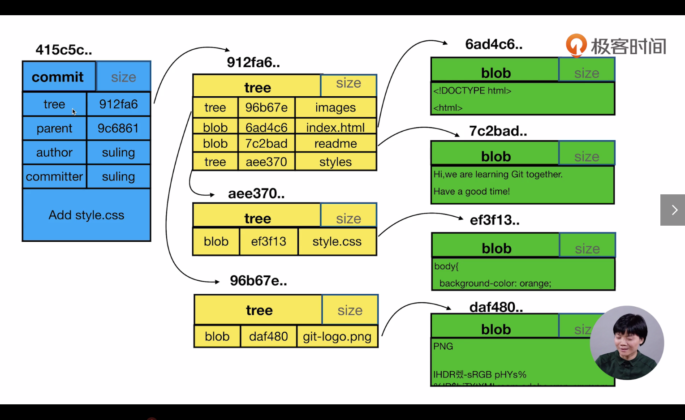

* 对内容进行了更改，就需要add和commit（如果你觉得有必要），那么commit表示的就是你这次提交的整个项目目录结构（更改后的），所以他会有一个tree对象，tree对象中的内容就是你的这整个文件目录
* 注意一点，对于内容相同的文件，那么他们的blob值是一样的，这样的好处是只用一个存储空间，其余的相同内容文件都指向这个空间

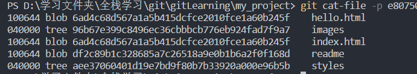

## 9. 一些细节

**tips：对于第一次的commit，不存在parent（当前提交的上一次提交）**

```js
// 1. 创建仓库
git init my_progect
// 2. 进入仓库
cd my_project
// 3. 创建目录
mkdir test
// 4. 创建文件并输入内容
echo 'hello,world' > readme
// 5. add
git add ./test/readme
// 6. commit
git commit -m 'add readme'
```

### 9.1  流程

* add之后会在objects中创建一个目录名+文件名等于对应hash的目录和文件（其实是一个blob对象）

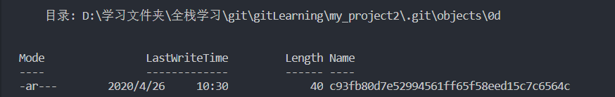

* commit后会创建3个这样的东西（分别代表commit（其中有一个tree，指向项目的目录结构），tree（表示的整个项目目录结构，其中有一个tree，指向test目录），tree（表示的test目录，其中有一个blob，指向具体文件，也就是这儿的readme））

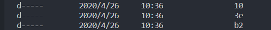

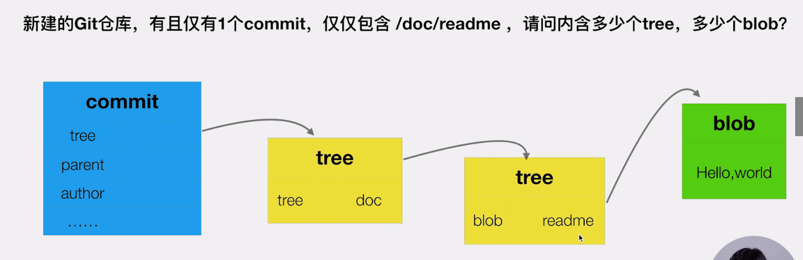

## 10. detach head  分离头指针

```js
// 1. 产生原因(当前你位于master分支，然后你切换到07545哈希值的commit)
git checkout 07545
// 2. 然后你的head指向07545，此时你项目某个文件更改了你需要进行提交
git commit -am 'bg to green' // 会产生一个哈希值，假设10895
// 3. 此时若你使用gitk查看所有的提交，你会发现根本没有bg to green的提交，因为git会对没有绑定分支的提交进行忽略，当然当你切换到master分支后，想要切换回来，你可以使用哈希值
gitk --all
// 4. 解决方法（绑定分支）
git branch fix_css 10895
// 5. 使用gitk查看(可以看见存在fix_css分支，且有bg to freen)
gitk --all
```

**tips：一般都是clone下来项目，然后：`git checkout -b '新分支名' '某次提交的hash||分支名'` ，意思就是基于某次提交或已有的分支所创建的分支**

## 11. 关于HEAD和branch

```js
// 1. 新建分支并切换
git checkout -b fix_readme fix_css
// 2. 此时HEAD文件中的内容为 ref: refs/heads/fix_readme
// 3. 进行比较,当前指向的提交与它的父亲提交进行比较
git diff HEAD HEAD^1 // HEAD^1^1^1 代表父亲的父亲的父亲，可以用HEAD~3表示
```

## 12. 清除不要的分支

```js
git branch -d '分支名'
// -d做不了就用-D
git branch -D '分支名'
```

## 13. 修改commit的message

```js
// 最近提交
git commit --amend
// 修改老旧commit的message
git rebase -i '需要更改的提交的父亲的哈希'
// 弹出一个vim编辑框，将需要修改的提交的pick改成r然后保存
// 又弹出一个vim编辑框，这时候你只需要更改umessage然后保存就好了
```

## 14. 怎样把多个连续的commit合成一个

```js
git rebase -i '要和并的commit之前的那个commit的哈希'
// 弹出一个vim编辑框，将需要修改的提交的pick改成s然后保存，注意第一行是你最终要合到的commit，最后一行是你最近的一次commit，保存退出
// 又弹出一个vim编辑器，可以在写一个描述的语句（解释你为什么合并）
```

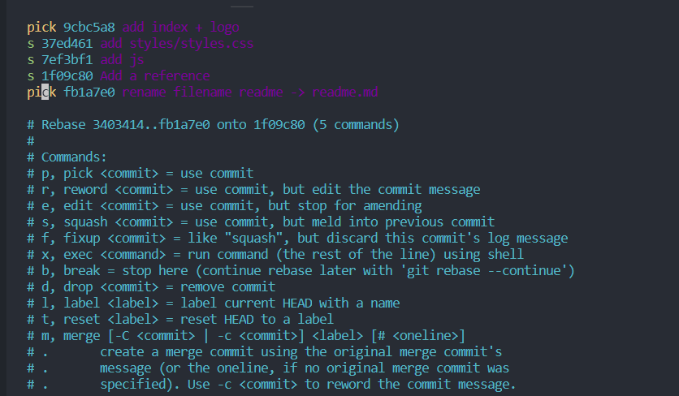

## 15. 怎样把多个不连续的commit合并

```js
思路和连续的一样，只不过将不连续的pick移动成连续的在一起，然后需要合并的commit将pick换成s
```

## 16. 怎么比较暂存区和HEAD所指向的提交之间的内容差异

```js
git diff --cached
```

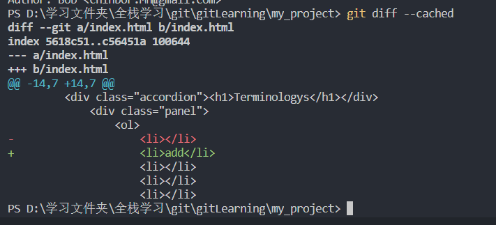

## 17. 比较工作区和暂存区的差异

```js
// diff命令将会比较工作区和暂存区的内容差异，而且是所有的文件的差异
git diff
// 后面可以跟具体的文件名,那么只会比较暂存区和工作区的特定文件，可以是多个文件名
git diff -- readme.md
```

**tips：每一次切换分支一定记得将当前分支中的修改进行提交**

## 18. 如何让暂存区恢复成和HEAD一样（全部文件恢复）

```js
// 这样就会撤回暂存区的内容，回到工作区（文件还是修改了的）
git reset HEAD
```

## 19. 如何让工作区修改还原

```js
git checkout -- '文件名'
```

## 20. 如何取消暂存区部分文件恢复成和HEAD一样

```js
git reset HEAD .\styles\style.css
```

## 21. 消除最近的几次提交（也可以是HEAD）

```js
git reset --hard '想要回退到的提交的哈希值'
git reset --hard HEAD // 前提是你暂存区内容没有commit，不然的话会更新HEAD指针，这样可以回退到未更改的状态
```

## 22. 比较不同分支的差异

```js
git diff (分支1) (分支2) // 比较的都是最新一次提交，而且是所有文件的差异
git diff (分支1) (分支2) -- '文件名'  // 比较不同分支的特定文件的差异
```

## 23. 不同提交的指定文件的差异（根据提交后产生的hash值来进行比较）

```js
git diff 'hash1' 'hash2' -- 'filename'
```

## 24 正确的删除文件的方法

```js
git rm 'filename'  // 删除文件同时添加到了暂存区
```

## 25. 使用stash命令（目的就是当你遇见了紧急任务，但是自己手头的任务不能丢掉，你就可以先使用stash将它存起来）

```js
git stash // 将当前的工作区的修改存起来，然后你可以做你新接到的任务，新的任务完成后提交了，再恢复
git stash apply // 取出之前存放的内容返回到工作区，但是stash list中的内容并没有删除，可以继续使用
git stash pop // 和apply一样的作用，不过会droppedstash list中的内容
```

## 26. 指定不需要GIT管理的特定文件以及文件夹

```js
项目根目录下创建.gitignore文件，在其中写出不需要进行管理的文件以及文件夹
```

## 27. 如何为github帐号添加ssh公钥

* checking for existing SSH keys

> 1. 打开git bash
>
> 2. `ls -al ~/.ssh`,查看其中是否有公私钥文件
>
> 3. 没有的话就输入以下命令`ssh-keygen -t rsa -b 4096 -C "your_email@example.com"`，然后一直回车就行
>
> 4. 进入github官网，在setting中找到SSH and GPG KEYS选项，进入new SSH keys，将你在本地的`.ssh`文件夹下的`.hub`文件中的内容复制到这里

## 28. 把本地仓库同步到github（注意，我使用的ssh）

```shell
# 查看有哪些远程仓库
git remote -v 
# git remote add git_learning git@github.com:chinbor/git_learning.git
git remote add '对远程仓库取的名字' '远程仓库地址'  
# 将远程仓库拉到本地
git fetch '对远程仓库取的名字' '对应分支名'  # git fetch git_learning master
git branch -av # 列出所有的分支，包括远端（本地也可以是远端）
git merge git_learning/master # 与远端的树进行合并，注意，有一点要求就是一定是要在同一分支，比如你的目的是合并本地的master分支和远端的master分支，由于没有历史关系，是两棵不同的树，所以需要用下面命令
git merge --allow-unrelated-histories git_learning/master
git push git_learning master # 向远程仓库的master分支push
```

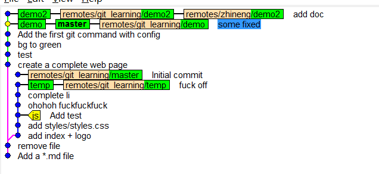

merge后的树形图：

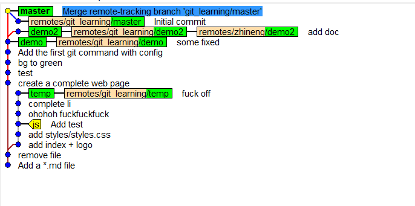

push后的树形图

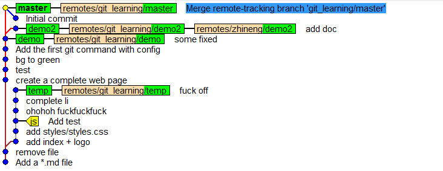

## 29. 不同人修改了不同文件（多个工作人员都clone下来了同一个项目，然后需要对同一个分支进行更改，所以在本地创建分支然后进行修改，改好了之后再push到远端分支，但是问题在于其中一个已经push了，另一个还在修改，那么这个还在修改的工作人员的这个分支的内容不是最新的，所以需要git fetch拉下来最新的，然后git merge ''对应分支名''，之后再git push）

### 29.1 准备工作

>  在这里我进行模拟，
>
> 就是clone下来，然后使用`git config --add --local user.name '姓名'和git config --add --local user.email '邮箱'`创建不同用户，可以使用`git config --local -l`查看仓库用户
>
> a用户的工作目录是my_project，他的本地仓库的用户的姓名和email如下：
>
> ````shell
> user.name=Bob
> user.email=chinbor.Mn@gmail.com
> ````
>
> b用户的工作目录是git_learning，他的本地仓库的用户的姓名和email如下
>
> ```shell
> user.name=chinbor
> user.email=949524548@qq.com
> ```
>
> 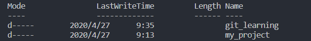

### 29.2 开始

* `git_learning`目录下使用`git branch -av`

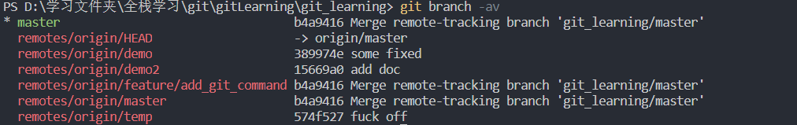

* 基于远端的`origin/feature/add_git_command`分支在本地创建`feature/add_git_command`分支,同时切换到本地创建的这个分支


* 查看本地仓库的分支（`git branch -v`）
* 修改readme.md文件,然后add，commit，push（不需要后面加远端名称）

* 另一个工作目录跟这的操作一样，所以不做赘述

解释一句话（ahead 1表示本地有一个commit比远端新，behind 1表示远端有一个commit比本地新，产生的原因可能是其他工作人员push了新的更改）

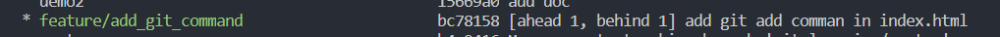

## 30. 不同人修改了同文件的不同地方（好习惯是开发之前，git pull（做了fetch和merge两件事）和远端同步）

>开发前先git pull，然后在push

## 31. 不同人修改了同文件的同一个地方

```shell
git pull # 然后会发现出现冲突，因为更改了同一个文件的同一个地方，这时候需要和伙伴协商解决冲突
git commit -am 'resolved conflict by hand' # 解决冲突后需要再次提交
git push # 推到远程服务器
```

## 32. 同时修改了文件名和文件内容，同一个文件，一个人修改了文件名并提交，一个人修改了文件内容还未提交

```shell
我擦操作和之前的一样，git智能到当修改文件内容的人员进行pull的时候能够帮你自动重命名文件（本地和远程不同名字的文件（rename了的）），同时你对文件的内容更改也依旧保存（前提是你commit了）
```

## 33. 多人修改了同一个文件的文件名（会出现冲突，需要手动解决）

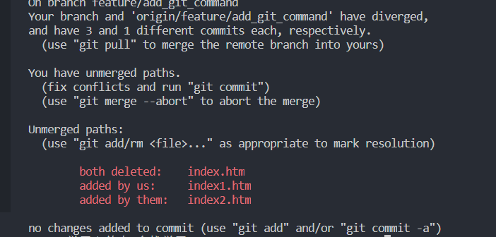

```shell
# 你想要叫index1.html
git rm index.htm
git rm index2.htm
git add index1.htm
git commit -m 'Resolved conflict by hand & rename index to index1'
# 将当前分支的更改推到远端对应的分支，默认clone下来的远端叫origin，当然可以用git fetch来指定远端服务器名称
git push origin feature/add_git_commands
```

## 34. 注意别tm使用git push -f

`-f`代表强制更新,不会管是否有新的提交

## 35. 注意集成分支（也就是多人开发的一个分支）不要做rebase（变基）操作，只能是在当前commit的基础上继续commit,因为当你rebase之后，会出现新的分支，然后你又需要和远程服务器进行pull，然后再push，当别人pull的时候，会出现很多的提交，不方便别人观看commit

为什么？

* 因为rebase会将你的哈希值更改，同时会创建另一条分支，如下图，我在`add hello.c file `处进行了`rebase i `操作对`add a readme`进行修改，改成`add a readme.md file`，结果出现了分支

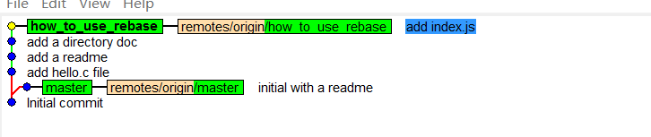

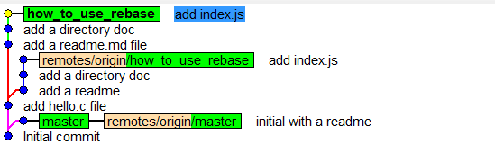

* 观察你进行rebase操作的那个分支发现`ahead 3`和`behind 3`是因为你在本地rebase之后创建了3个hash值不同的commit，所以领先远端3次提交，而远端的3次提交的hash值在你本地没有，所以远端领先你3次提交

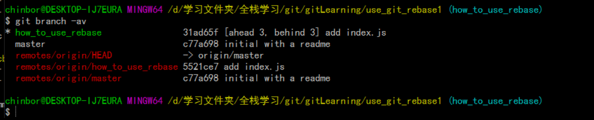

* git pull进行合并

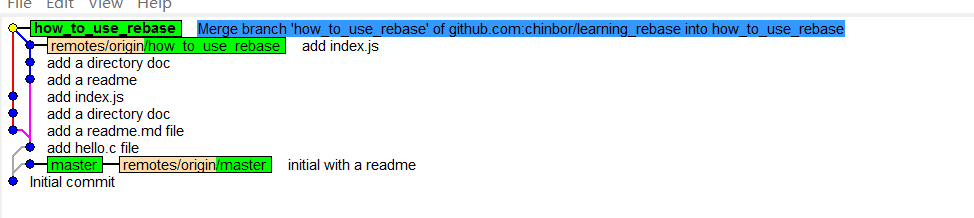

* git push 推到远端

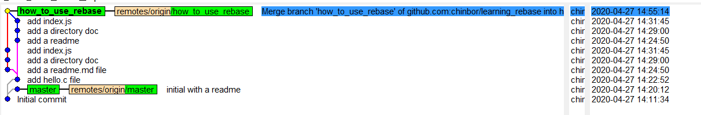

## 36. 关于如何在github搜索好的资料

`'搜索关键字' in:readme starts:>1000` ：代表的含义就是在readme文件中搜索我给的关键字，同时挑选其中starts数大于1000的仓库

## 37. 以组织的方式使用github

```shell
1. 组织有仓库
2. 组织的建立者可以邀请成员（成员可以看见组织的所有仓库，所有的团队，然后根据需要向某个项目进行申请，管理员再进行同意或绝）
3. 根据成员的工作的不同，可以分为不同的团队负责不同的仓库（还可以给予权限，read，admin，write）
```

## 38. project就是看板

